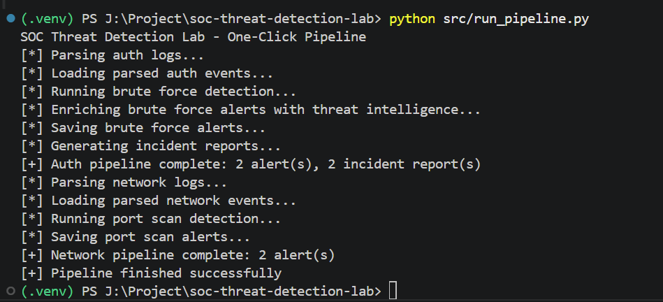

# SOC Threat Detection Lab (Python | SIEM-Style Detection Engineering)

Simulates a real-world SOC pipeline to detect and analyze brute force attacks and port scanning using Python-based detection engineering, threat intelligence enrichment, and automated incident reporting.

---

## 🚀 Quick Demo

Run the entire SOC pipeline:

```bash
python src/run_pipeline.py
```

### Example Output

```text
SOC Threat Detection Lab - One-Click Pipeline
[*] Parsing auth logs...
[*] Running brute force detection...
[+] Auth pipeline complete: 2 alert(s), 2 incident report(s)
[*] Parsing network logs...
[*] Running port scan detection...
[+] Network pipeline complete: 2 alert(s)
[+] Pipeline finished successfully
```

---

## Overview

This project demonstrates practical SOC analyst and detection engineering skills by building an end-to-end pipeline that:

* Parses and normalizes raw security logs
* Detects brute force attacks and port scanning activity
* Enriches alerts using VirusTotal threat intelligence
* Generates structured incident reports
* Automates the entire workflow with a single command

---

## 🎯 Why This Project

This project was built to simulate real-world SOC operations and demonstrate hands-on experience in:

* Detecting malicious activity from raw logs
* Correlating events using time-based detection rules
* Enriching alerts with external threat intelligence
* Generating actionable incident reports

It reflects the workflow used in real SIEM platforms like Splunk and Microsoft Sentinel.

---

## 📸 Screenshots

### SOC Pipeline Execution



### Incident Report Output


---

## 💼 Key Skills Demonstrated

* Security Operations Center (SOC) workflows
* Detection engineering (rule-based detection)
* Log parsing and normalization
* Threat intelligence enrichment (VirusTotal API)
* Incident analysis and reporting
* Security automation using Python
* Attack simulation using Kali Linux (Nmap)

---

## ⭐ Project Highlights

* Built a SOC-style detection pipeline from scratch
* Implemented brute force and port scan detection rules
* Integrated VirusTotal API for threat intelligence
* Automated full workflow with a single command
* Simulated real-world attacks using Kali Linux

---

## 🧠 Architecture

```
Raw Logs  
   ↓  
Parser (Normalization)  
   ↓  
Detection Engine (Brute Force / Port Scan)  
   ↓  
Threat Intelligence Enrichment (VirusTotal)  
   ↓  
Alerts  
   ↓  
Incident Reports  
```

---

## ⚙️ Tech Stack

* Python 3.11+
* Requests (API integration)
* Python-dotenv (secure API key handling)
* VirusTotal API
* JSON (event storage & alerts)

---

## 📂 Project Structure

```
soc-threat-detection-lab/
├── data/
│   ├── raw/
│   └── processed/
├── detections/
├── reports/
├── src/
│   ├── parser.py
│   ├── detector.py
│   ├── enrich.py
│   ├── portscan_detector.py
│   ├── report.py
│   └── run_pipeline.py
├── screenshots/
├── .env.example
├── .gitignore
├── requirements.txt
└── README.md
```

---

## ⚡ Quick Start

### 1. Clone the repository

```bash
git clone https://github.com/jayvpatel75/soc-threat-detection-lab.git
cd soc-threat-detection-lab
```

### 2. Create and activate virtual environment

```bash
python -m venv .venv
.venv\Scripts\Activate.ps1
```

### 3. Install dependencies

```bash
pip install -r requirements.txt
```

### 4. Configure environment variables

Create a `.env` file from `.env.example`:

```env
VT_API_KEY=your_api_key_here
```

### 5. Run the pipeline

```bash
python src/run_pipeline.py
```

---

## 🔍 Detection Logic

### Brute Force Detection

* Tracks failed login attempts per IP
* Uses sliding time window correlation
* Detects abnormal authentication patterns

### Port Scan Detection

* Tracks unique ports accessed per IP
* Identifies reconnaissance behavior
* Uses threshold-based detection within time window

---

## 🔐 Detection Capabilities

### Brute Force Detection

```json
{
  "source_ip": "192.168.1.50",
  "failed_attempts": 5,
  "severity": "high",
  "threat_intel": {
    "malicious": 1
  }
}
```

### Port Scan Detection

```json
{
  "source_ip": "192.168.1.200",
  "unique_ports": 8,
  "severity": "high"
}
```

---

## 🧾 Incident Reporting

```json
{
  "incident_id": "INC-xxxxxxx",
  "severity": "high",
  "summary": "Potential brute force attack detected",
  "analysis": "Multiple failed login attempts detected...",
  "recommended_actions": [
    "Block IP address",
    "Monitor activity",
    "Escalate incident"
  ]
}
```

---

## 🌐 Threat Intelligence Integration

* Integrated VirusTotal API
* Enriches alerts with:

  * Malicious score
  * Reputation data
* Used to dynamically adjust severity

---

## 🧪 Attack Simulation

* Simulated brute force attacks via auth logs
* Simulated real port scans using Kali Linux (`nmap`)
* Validated detections against realistic attack patterns

---

## 🔥 Key Features

* Log normalization and parsing (multi-source)
* Detection engineering with sliding window logic
* Alert deduplication and correlation
* Threat intelligence enrichment
* Automated incident reporting
* One-click SOC pipeline execution

---

## 💼 Resume Value

This project demonstrates:

* SOC workflow understanding
* Detection rule development
* Threat intelligence integration
* Incident analysis and reporting
* Security automation using Python

---

## ⚠️ Ethical Use

This project is intended for educational and defensive security purposes only.

---

## 🚀 Future Improvements

* Slack / Email alerting
* SIEM integration (Splunk / ELK)
* Dashboard (Streamlit)
* Windows Event Log support
* Additional detection rules
