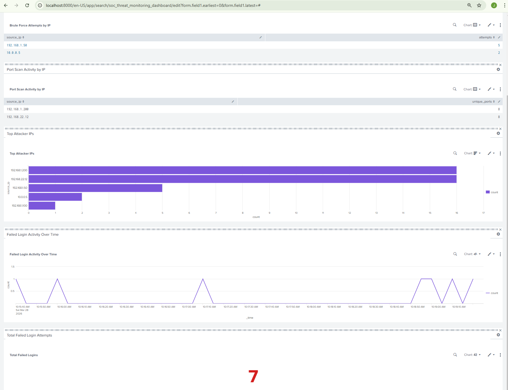

# SOC Threat Detection Lab (Python | SIEM-Style Detection Engineering)

Simulates a real-world Security Operations Center (SOC) pipeline to detect and analyze brute force attacks and port scanning using Python-based detection engineering, threat intelligence enrichment, SIEM integration (Splunk), and real-time alerting.

---

## 🚀 Quick Demo

Run the entire SOC pipeline:

```bash
python src/run_pipeline.py
```

### Example Output

```text
SOC Threat Detection Lab - One-Click Pipeline
[*] Parsing auth logs...
[*] Running brute force detection...
[+] Auth pipeline complete: 2 alert(s), 2 incident report(s)
[*] Parsing network logs...
[*] Running port scan detection...
[+] Network pipeline complete: 2 alert(s)
[+] Pipeline finished successfully
```

---

## 📊 SOC Dashboard (Splunk)



👉 Built using Splunk SIEM to visualize:

* Brute force attacks
* Port scanning activity
* Top attacker IPs
* Login activity trends

---

## 📸 Screenshots

### SOC Pipeline Execution


### Incident Report Output


---

## 🎯 Overview

This project demonstrates practical SOC analyst and detection engineering skills by building an end-to-end pipeline that:

* Parses and normalizes raw security logs
* Detects brute force attacks and port scanning activity
* Enriches alerts using VirusTotal threat intelligence
* Sends real-time alerts via Slack webhooks
* Maps detections to MITRE ATT&CK techniques
* Generates structured incident reports
* Visualizes data using Splunk dashboards
* Automates the entire workflow with a single command

---

## 🧠 Architecture

```
Raw Logs  
   ↓  
Parser (Normalization)  
   ↓  
Detection Engine (Brute Force / Port Scan)  
   ↓  
Threat Intelligence Enrichment (VirusTotal)  
   ↓  
Alerting (Slack Webhooks)  
   ↓  
SIEM Visualization (Splunk Dashboard)  
   ↓  
Incident Reports  
```

---

## 💼 Key Skills Demonstrated

* Security Operations Center (SOC) workflows
* Detection engineering (rule-based detection)
* Log parsing and normalization
* Threat intelligence enrichment (VirusTotal API)
* MITRE ATT&CK mapping (T1110, T1046)
* SIEM usage (Splunk SPL queries & dashboards)
* Real-time alerting (Slack Webhooks)
* Incident analysis and reporting
* Security automation using Python
* Attack simulation using Kali Linux (Nmap)

---

## ⭐ Project Highlights

* Built a SOC-style detection pipeline from scratch
* Implemented brute force and port scan detection using sliding-window correlation
* Integrated VirusTotal API for threat intelligence enrichment
* Added real-time alerting using Slack webhooks
* Mapped detections to MITRE ATT&CK techniques
* Created Splunk dashboard for visualization and monitoring
* Simulated real-world attacks using Kali Linux

---

## ⚙️ Tech Stack

* Python 3.11+
* Requests
* python-dotenv
* VirusTotal API
* Slack Webhooks
* Splunk (SIEM)
* JSON (event storage & alerts)

---

## 📂 Project Structure

```
soc-threat-detection-lab/
├── data/
│   ├── raw/
│   └── processed/
├── detections/
├── reports/
├── src/
│   ├── parser.py
│   ├── detector.py
│   ├── enrich.py
│   ├── portscan_detector.py
│   ├── report.py
│   ├── alerting.py
│   └── run_pipeline.py
├── screenshots/
├── .env.example
├── .gitignore
├── requirements.txt
└── README.md
```

---

## ⚡ Quick Start

### 1. Clone the repository

```bash
git clone https://github.com/jayvpatel75/soc-threat-detection-lab.git
cd soc-threat-detection-lab
```

### 2. Create and activate virtual environment

```bash
python -m venv .venv
.venv\Scripts\Activate.ps1
```

### 3. Install dependencies

```bash
pip install -r requirements.txt
```

### 4. Configure environment variables

Create a `.env` file from `.env.example`:

```env
VT_API_KEY=your_api_key_here
SLACK_WEBHOOK_URL=your_webhook_url_here
```

### 5. Run the pipeline

```bash
python src/run_pipeline.py
```

---

## 🔍 Detection Logic

### Brute Force Detection (MITRE T1110)

* Tracks failed login attempts per IP
* Uses sliding time window correlation
* Detects abnormal authentication patterns

### Port Scan Detection (MITRE T1046)

* Tracks unique ports accessed per IP
* Identifies reconnaissance behavior
* Uses threshold-based detection within time window

---

## 🔐 Detection Capabilities

### Brute Force Detection

```json
{
  "source_ip": "192.168.1.50",
  "failed_attempts": 5,
  "severity": "high",
  "mitre": "T1110",
  "threat_intel": {
    "malicious": 1
  }
}
```

### Port Scan Detection

```json
{
  "source_ip": "192.168.1.200",
  "unique_ports": 8,
  "severity": "high",
  "mitre": "T1046"
}
```

---

## 🧾 Incident Reporting

```json
{
  "incident_id": "INC-xxxxxxx",
  "severity": "high",
  "summary": "Potential brute force attack detected",
  "analysis": "Multiple failed login attempts detected...",
  "recommended_actions": [
    "Block IP address",
    "Monitor activity",
    "Escalate incident"
  ]
}
```

---

## 🌐 Threat Intelligence Integration

* Integrated VirusTotal API
* Enriches alerts with:

  * Malicious score
  * Reputation data
* Used to dynamically adjust severity

---

## 🧪 Attack Simulation

* Simulated brute force attacks via authentication logs
* Simulated port scanning using Kali Linux (`nmap`)
* Validated detection logic against realistic attack scenarios

---

## 🔥 Key Features

* Multi-source log ingestion and normalization
* Detection engineering with sliding window logic
* Alert deduplication and correlation
* Threat intelligence enrichment
* Real-time Slack alerting
* Splunk SIEM integration and dashboard visualization
* Automated incident reporting
* One-click SOC pipeline execution

---

## 💼 Resume Value

This project demonstrates:

* SOC workflow understanding
* Detection rule development
* Threat intelligence integration
* SIEM usage (Splunk)
* Incident analysis and reporting
* Security automation using Python

---

## ⚠️ Ethical Use

This project is intended for educational and defensive security purposes only.

---

## 🚀 Future Improvements

* Email alerting integration
* Advanced SIEM correlation rules
* Streamlit dashboard
* Windows Event Log ingestion
* Additional detection rules (lateral movement, persistence)
