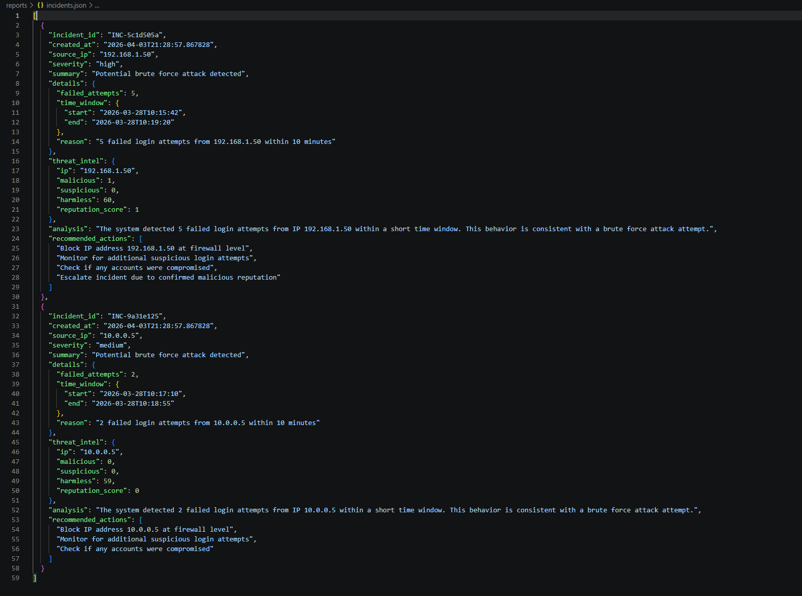

# SOC Threat Detection Lab (Python | SIEM-Style Detection Engineering)

A hands-on Security Operations Center (SOC) lab built in Python that simulates real-world workflows including log ingestion, detection engineering, threat intelligence enrichment, alerting, and incident reporting.

---

## 🚀 Overview

This project demonstrates practical SOC analyst and detection engineering skills by building an end-to-end pipeline that:

* Parses and normalizes raw security logs
* Detects brute force attacks and port scanning activity
* Enriches alerts using VirusTotal threat intelligence
* Generates structured incident reports
* Automates the entire workflow with a single command

---

## ⚡ Quick Start (Run in Minutes)

Follow these steps to run the SOC pipeline locally:

### 1. Clone the repository

```bash
git clone https://github.com/jayvpatel75/soc-threat-detection-lab.git
cd soc-threat-detection-lab
```

### 2. Create and activate virtual environment

```bash
python -m venv .venv
.venv\Scripts\Activate.ps1
```

### 3. Install dependencies

```bash
pip install -r requirements.txt
```

### 4. Configure environment variables

Create a `.env` file using `.env.example` and add your VirusTotal API key:

```env
VT_API_KEY=your_api_key_here
```

## ⚡ Run the SOC Pipeline

```bash
python src/run_pipeline.py
```

### 🔍 Sample Output

## 📸 Screenshots

### SOC Pipeline Execution


### Incident Report


---

### ✅ Expected Result

* Brute force attacks detected
* Port scan activity identified
* Alerts enriched with threat intelligence
* Incident reports generated automatically

## 🧠 Architecture

Raw Logs → Parser → Normalized Events → Detection Rules → Threat Intelligence → Alerts → Incident Reports

---

## ⚙️ Tech Stack

* Python 3.11+
* Requests (API integration)
* Python-dotenv (secure API key handling)
* VirusTotal API
* JSON (event storage & alerts)

---

## 📂 Project Structure

```
soc-threat-detection-lab/
├── data/
│   ├── raw/                # Input logs
│   └── processed/          # Parsed logs
├── detections/             # Detection outputs
├── reports/                # Incident reports
├── src/
│   ├── parser.py
│   ├── detector.py
│   ├── enrich.py
│   ├── portscan_detector.py
│   ├── report.py
│   └── run_pipeline.py
├── Screenshots/            # Demo screenshots
├── .env.example
├── .gitignore
├── requirements.txt
└── README.md
```

---

## 🔐 Detection Capabilities

### 1. Brute Force Detection

* Detects repeated failed login attempts
* Uses sliding time window correlation
* Enriched with threat intelligence

```json
{
  "source_ip": "192.168.1.50",
  "failed_attempts": 5,
  "severity": "high",
  "threat_intel": {
    "malicious": 1
  }
}
```

---

### 2. Port Scan Detection

* Detects reconnaissance activity (Nmap-style scans)
* Tracks unique ports accessed within a time window

```json
{
  "source_ip": "192.168.1.200",
  "unique_ports": 8,
  "severity": "high"
}
```

---

## 🧾 Incident Reporting

Automatically generates SOC-style reports:

```json
{
  "incident_id": "INC-xxxxxxx",
  "severity": "high",
  "summary": "Potential brute force attack detected",
  "analysis": "Multiple failed login attempts detected...",
  "recommended_actions": [
    "Block IP address",
    "Monitor activity",
    "Escalate incident"
  ]
}
```

---

## 🌐 Threat Intelligence Integration

* Integrated VirusTotal API
* Enriches alerts with:

  * Malicious score
  * Reputation data
* Used to dynamically adjust severity

---

## 🧪 Attack Simulation

* Simulated brute force attacks via auth logs
* Simulated real port scans using Kali Linux (`nmap`)
* Validated detections against realistic attack patterns

---

## 🔥 Key Features

* Log normalization and parsing (multi-source)
* Detection engineering with sliding window logic
* Alert deduplication and correlation
* Threat intelligence enrichment
* Automated incident reporting
* One-click SOC pipeline execution

---

## 💼 Resume Value

This project demonstrates:

* SOC workflow understanding
* Detection rule development
* Threat intelligence integration
* Incident analysis and reporting
* Security automation using Python

---

## ⚠️ Ethical Use

This project is intended for educational and defensive security purposes only.

---

## 🚀 Future Improvements

* Slack / Email alerting
* SIEM integration (Splunk / ELK)
* Dashboard (Streamlit)
* Windows Event Log support
* Additional detection rules

---
